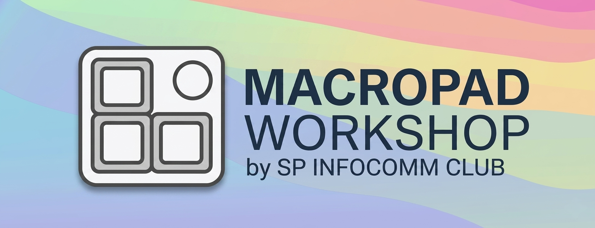

# SPIC Macropad Workshop 2026

---

## “Yay! You made a custom keyboard… 😄”

“…Eh. A tiny one.”

**A MACROPAD!!! 😆✨**

SPIC Macropad Workshop 2026 💖

---

## What is this???

A macropad is a small programmable keyboard.

This one has **3 buttons**.

That sounds too small to matter…

…but it absolutely does.

You can turn it into:
- a productivity boost 😄  
- a media controller  
- a coding shortcut machine  
- or something completely unnecessary (but satisfying) 😆✨  

Basically: small device, big personality.

(￣ー￣)

---

## Why does this exist?

Because full keyboard firmware systems feel like too much pain for something this small.

So we don’t do that.

Instead:

- Plug it in  
- Edit a simple file  
- It works instantly  

No compiling. No waiting. No “why dis broken again” moments.

Just simple control. 💖

---

## What you’ll use

- CircuitPython  
- A RP2040 board  
- 3 buttons  
- 1 RGB LED that reflects your mode... or mood 😄✨  

That’s it.

And somehow, that’s enough.

(｡•̀ᴗ-)✧

---

## What it does

Each button can do different things depending on the mode.

For example:
- Copy / Paste / Cut  
- Volume control / media playback  
- Save / Undo / Redo  
- Zoom / Teams / Discord shortcuts  
- Or your own custom chaos 😆  

Same buttons. Different behaviour. New personality.

---

## Modes

The LED tells you what mode you are in.

And each mode changes what the 3 buttons do.

You’ll find:
- Clipboard mode 😄  
- Media mode  
- Coding mode 💖  
- Communication mode (Zoom / Teams / Discord)  
- Custom mode ✨  
- A “why did I do this” mode 😆  

(you’ll understand when you see it)

---

## Switching modes

Press Button 1 + Button 2 together.

The LED changes.

That’s it.

You are now in a different mode.

(￣▽￣)

---

## Custom mode

There is a simple config file where you can define your own setup.

You choose:
- what each button does  
- what color the LED shows  
- whether it behaves normally or becomes slightly unhinged (you'll see...) 😆✨  

No complicated setup. Just edit and save.

---

## Philosophy

This is not about building a complex system.

It’s about making something small feel useful and fun.

Fast to change. Easy to understand. Immediate feedback.

If it feels complicated, it is wrong. 💖

---

## SPIC Macropad Workshop 2026

You came in thinking:

“it’s just 3 buttons…”

You leave thinking:

“Small... But big in personality... Eh.” 😄✨

---

Credits to Organisers of 2025 Macropad Workshop and Jerick Seng
